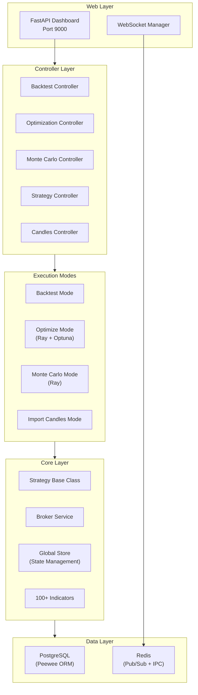

# Jesse

> **Last Updated**: 2026-04-06T16:25:30Z  \
> **Git Hash**: `5902a0dd`

**Version**: 1.11.0
**Language**: Python 3.10+
**License**: MIT

## Overview

Jesse is an advanced algorithmic trading framework for cryptocurrency markets. It provides a complete research-to-production pipeline: strategy development, backtesting, hyperparameter optimization, Monte Carlo simulation, and live trading -- all driven from a web dashboard built on FastAPI.

The framework emphasizes simplicity in strategy code while delivering institutional-grade features: 100+ built-in technical indicators, multi-symbol and multi-timeframe trading, distributed optimization via Ray/Optuna, and realistic order simulation with slippage modeling.

## Key Features

| Category | Capabilities |
|----------|-------------|
| **Strategy Development** | Python class inheritance model, lifecycle hooks, built-in indicator library, ML integration |
| **Backtesting** | Event-driven candle simulation, multi-route support, 16 timeframes, realistic order matching |
| **Optimization** | Distributed via Ray, Optuna-based search, Sharpe/Calmar/Sortino/Omega/Serenity objectives |
| **Monte Carlo** | Trade reshuffling simulation, candle perturbation (Gaussian noise, moving block bootstrap) |
| **Live Trading** | Optional `jesse-live` plugin, 20+ exchange support, WebSocket streaming, paper trading |
| **Web Dashboard** | Strategy editor, backtest charts, optimization UI, candle import, real-time monitoring |

## Architecture at a Glance



## Quick Start

### Prerequisites

- Python 3.10+
- PostgreSQL (for candle storage and session tracking)
- Redis (for inter-process communication and pub/sub)

### Installation

```bash
pip install -e .
```

### Minimal Setup

Jesse requires PostgreSQL and Redis to run backtests via its web dashboard. Configure them in a `.env` file:

```env
POSTGRES_HOST=localhost
POSTGRES_DB=jesse
POSTGRES_USER=jesse
POSTGRES_PASSWORD=jesse
REDIS_HOST=localhost
REDIS_PORT=6379
APP_PASSWORD=test
```

Then start the dashboard with `jesse run` and access it at `http://localhost:9000`.

### Strategy Definition Example

The following demonstrates Jesse's strategy pattern. Strategies are Python classes with lifecycle hooks that the framework calls during backtesting and live trading:

```python
from jesse.strategies import Strategy
import jesse.indicators as ta
from jesse import utils

class GoldenCross(Strategy):
    """Go long when fast EMA crosses above slow EMA."""

    @property
    def fast_ema(self):
        return ta.ema(self.candles, 20)

    @property
    def slow_ema(self):
        return ta.ema(self.candles, 50)

    def should_long(self) -> bool:
        return self.fast_ema > self.slow_ema

    def go_long(self):
        qty = utils.size_to_qty(self.balance * 0.05, self.price)
        self.buy = qty, self.price
        self.stop_loss = qty, self.price * 0.95
        self.take_profit = qty, self.price * 1.10

    def should_short(self) -> bool:
        return False

    def go_short(self):
        pass

    def filters(self) -> list:
        return [self._rsi_filter]

    def _rsi_filter(self):
        """Only enter when RSI is not overbought."""
        return ta.rsi(self.candles, 14) < 70
```

### Running Backtests Programmatically (Testing)

For unit testing or programmatic use without the web dashboard, Jesse provides testing utilities:

```python
from jesse.testing_utils import set_up, get_btc_candles, single_route_backtest
from jesse.enums import exchanges
from jesse.config import config

# Initialize test environment (no DB required)
set_up(is_futures_trading=True, leverage=1, fee=0)

# Run a backtest with synthetic candle data
single_route_backtest('TestStrategy01', trend='up', candles_count=100)

# Access results from the global store
from jesse.store import store
print(f"Positions tracked: {len(store.completed_trades.trades)}")
```

## Project Structure

```
src/jesse/
    __init__.py              # FastAPI app, CLI, route registration
    strategies/Strategy.py   # Base strategy class (1752 lines)
    modes/
        backtest_mode.py     # Backtesting engine
        optimize_mode/       # Ray + Optuna optimization
        monte_carlo_mode/    # Monte Carlo simulation
        import_candles_mode/ # Exchange candle importers
    store/                   # Centralized state management
    services/                # Broker, metrics, notifier, cache, DB
    controllers/             # FastAPI route handlers
    models/                  # Peewee ORM models
    indicators/              # 100+ technical indicators
    exchanges/               # Exchange abstraction layer
```

## Supported Exchanges

Binance (spot + futures), Bybit (spot + USDT/USDC perpetual), Bitfinex, Coinbase, Gate.io, Hyperliquid, Apex Pro -- with testnet variants for most.

## Documentation

- [Architecture](architecture.md) — System design and components
- [Workflow](workflow.md) — Event flows and processing pipelines
- [State Management](state-management.md) — State lifecycle and data models
- [Development](development.md) — Development guide and best practices

## Links

- Documentation: https://docs.jesse.trade
- Discord: https://jesse.trade/discord
- GitHub: https://github.com/jesse-ai/jesse
