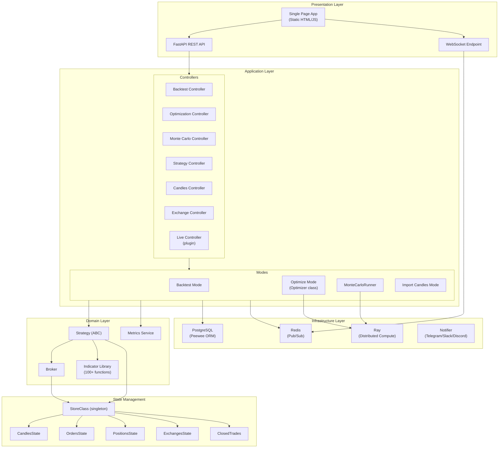
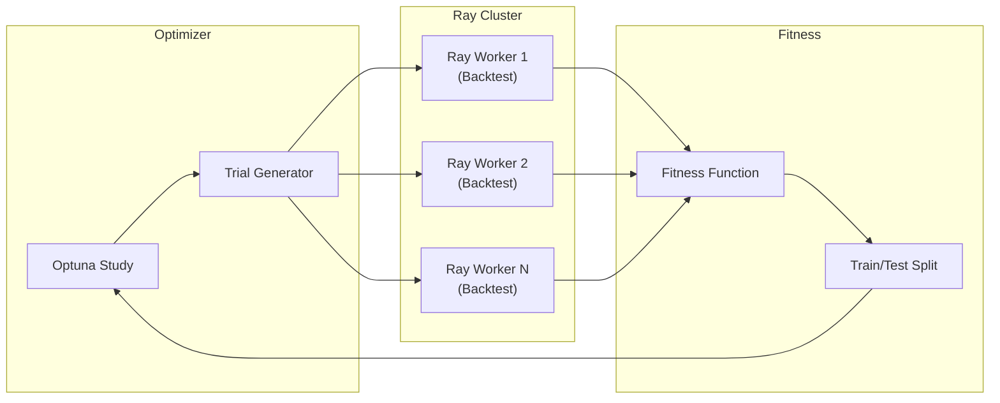

# Jesse -- Architecture

## System Architecture

Jesse follows a **strategy-centric, event-driven architecture** with centralized state management. The system is organized into distinct layers, each with clear responsibilities.



## Trading Paradigm & Key Features

| Feature | Support | Details |
|---------|---------|---------|
| Backtesting Approach | Event-driven | 1-minute candle simulation with higher-timeframe generation on the fly |
| Live Trading | Yes | Via optional `jesse-live` plugin supporting 20+ exchanges (Binance, Bybit, Bitget, etc.) |
| Paper Trading | Yes | Sandbox exchange for simulated trading; paper mode available via jesse-live plugin |
| Multi-Asset | Yes | Crypto only (spot and futures); multi-symbol and multi-timeframe routes |
| Data Feeds | Exchange REST APIs | Binance, Bybit, Bitfinex, Coinbase, Gate.io, Hyperliquid, Apex Pro |
| ML Integration | No | No built-in ML; strategies are rule-based Python classes with indicator access |
| Risk Management | Built-in | Stop-loss, take-profit, position sizing utilities (`size_to_qty`, `risk_to_qty`) |
| Optimization | Yes | Distributed hyperparameter optimization via Ray + Optuna with train/test splits |
| Execution | Both | Simulated via Sandbox exchange; live via jesse-live plugin with real exchange connectivity |

## Component Details

### 1. Strategy Layer

**File**: `src/jesse/strategies/Strategy.py`

The `Strategy` abstract base class is the heart of Jesse. Every user strategy extends it and implements entry/exit logic through lifecycle hooks.

Key attributes:
- `self.buy` / `self.sell` -- Order submission via property assignment
- `self.stop_loss` / `self.take_profit` -- Exit order definitions
- `self.position` -- Current `Position` instance
- `self.broker` -- `Broker` instance for order routing
- `self.hp` -- Hyperparameters dictionary (populated during optimization)
- `self.vars` -- Shared mutable state dictionary

The Strategy class uses a **shadow variable pattern** for order management: `self.buy` and `self._buy` are compared each cycle to detect new order submissions, cancel stale orders, and submit fresh ones.

### 2. Backtesting Engine

**File**: `src/jesse/modes/backtest_mode.py`

The backtesting engine simulates trading by:

1. Loading 1-minute candle data from PostgreSQL
2. Generating higher-timeframe candles on-the-fly (supports 16 timeframes: 1m through 1W)
3. Feeding candles sequentially to strategy instances
4. Executing orders through the `Broker` against the `Sandbox` exchange
5. Tracking performance metrics (Sharpe, Sortino, Calmar, max drawdown, win rate, etc.)

Multi-route support allows simultaneous backtesting of multiple symbol/timeframe/strategy combinations with shared state.

### 3. Optimization Engine

**File**: `src/jesse/modes/optimize_mode/Optimize.py`

Uses **Ray** for distributed parallel execution and **Optuna** for hyperparameter search.



Supported objective functions: `sharpe`, `calmar`, `sortino`, `omega`, `serenity`, `smart sharpe`, `smart sortino`.

Strategies define searchable hyperparameters:
```python
def hyperparameters(self):
    return [
        {'name': 'ema_period', 'type': int, 'min': 10, 'max': 200, 'default': 50},
    ]
```

### 4. Monte Carlo Simulation

**File**: `src/jesse/modes/monte_carlo_mode/MonteCarloRunner.py`

Two simulation modes, both parallelized via Ray:

- **Trades simulation**: Reshuffles the order of completed trades to estimate confidence intervals around key metrics (total return, max drawdown, Sharpe, Calmar)
- **Candles simulation**: Perturbs historical candle data using configurable pipelines:
  - `GaussianNoiseCandlesPipeline` -- Adds Gaussian noise to OHLCV data
  - `MovingBlockBootstrapCandlesPipeline` -- Resamples candle blocks

### 5. Exchange Abstraction

**File**: `src/jesse/exchanges/exchange.py`

Abstract `Exchange` interface with methods: `market_order`, `limit_order`, `stop_order`, `cancel_order`, `cancel_all_orders`.

Implementations:
- `Sandbox` -- In-memory simulation exchange for backtesting
- Live exchange drivers via `jesse-live` plugin (Binance, Bybit, etc.)

Exchange instances hold fee configuration, leverage settings, and balance management.

### 6. Broker Service

**File**: `src/jesse/services/broker.py`

Sits between Strategy and Exchange, providing:
- `buy_at(qty, price)` / `sell_at(qty, price)` -- Limit orders
- `buy_at_market(qty)` / `sell_at_market(qty)` -- Market orders
- `reduce_position_at(qty, price)` -- Partial exits
- `start_profit_at(side, qty, price)` -- Take profit orders

The Broker validates quantities, determines order type based on price relationships, and delegates to the Exchange API.

### 7. Data Models

**File**: `src/jesse/models/`

Peewee ORM models backed by PostgreSQL:

| Model | Purpose |
|-------|---------|
| `Candle` | Historical OHLCV data |
| `Order` | Order history and tracking |
| `Position` | Position state (entry/exit price, qty, PnL, liquidation price) |
| `ClosedTrade` | Completed trade records |
| `BacktestSession` | Backtest metadata and results |
| `OptimizationSession` | Optimization trial records |
| `MonteCarloSession` | Monte Carlo simulation results |
| `FuturesExchange` / `SpotExchange` | Exchange configuration |

### 8. Indicator Library

**File**: `src/jesse/indicators/`

100+ technical indicators implemented as pure functions operating on NumPy arrays. Key indicators include: EMA, SMA, RSI, MACD, Bollinger Bands, ATR, ADX, Stochastic, SuperTrend, HMA, ALMA, and many more.

All indicators accept candle arrays of shape `(n, 6)` with columns `[timestamp, open, close, high, low, volume]`.

### 9. Web Dashboard

**File**: `src/jesse/__init__.py`

The FastAPI application serves:
- A static SPA (single-page application) from `jesse/static/`
- REST API endpoints for all operations (backtest, optimize, strategy CRUD, candle management)
- A WebSocket endpoint at `/ws` for real-time updates
- Redis pub/sub for inter-process communication between background workers and the web client

### 10. Candle Import System

**File**: `src/jesse/modes/import_candles_mode/`

Driver-based architecture for fetching historical candles from exchanges. Each exchange has a dedicated driver implementing a common interface (`CandleExchangeInterface`). Drivers handle pagination, rate limiting, and data normalization.

Supported sources: Binance, Bybit, Bitfinex, Coinbase, Gate.io, Hyperliquid, Apex Pro.

---
## See Also
- [README](README.md) — Project overview and quick start
- [Workflow](workflow.md) — Event flows and processing pipelines
- [State Management](state-management.md) — State lifecycle and data models
- [Development](development.md) — Development guide and best practices
