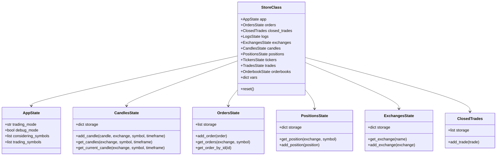
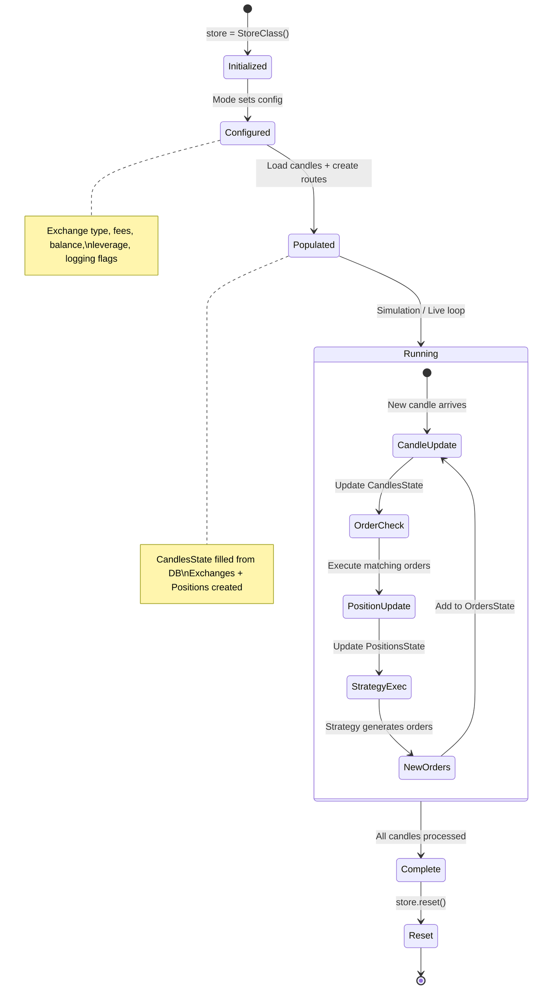
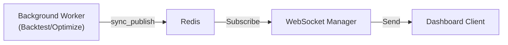

# Jesse -- State Management

## Overview

Jesse uses a **centralized global store** pattern for state management. A singleton `StoreClass` instance holds all runtime state and is accessible from any part of the system via `from jesse.store import store`.

## Store Architecture



## State Slices

### CandlesState

Stores OHLCV data as NumPy arrays with shape `(n, 6)`:

| Column Index | Field | Description |
|-------------|-------|-------------|
| 0 | timestamp | Unix timestamp in milliseconds |
| 1 | open | Opening price |
| 2 | close | Closing price |
| 3 | high | High price |
| 4 | low | Low price |
| 5 | volume | Trading volume |

Candles are stored per exchange/symbol/timeframe combination. The backtesting engine generates higher timeframe candles from 1-minute data on the fly.

### OrdersState

Tracks all active orders. Each `Order` object contains:
- `id`, `exchange`, `symbol`
- `type` (market, limit, stop)
- `side` (buy, sell)
- `qty`, `price`
- `status` (active, executed, cancelled)
- `submitted_via` (entry, stop_loss, take_profit)

### PositionsState

Manages open positions per exchange/symbol. Each `Position` tracks:
- `entry_price`, `exit_price`, `current_price`
- `qty`, `previous_qty`
- `opened_at`, `closed_at`
- `mark_price`, `funding_rate` (live mode)
- `liquidation_price` (futures)

Key computed properties:
- `pnl` -- Unrealized profit/loss
- `pnl_percentage` -- PnL as percentage of entry
- `is_open` / `is_close` -- Position state
- `type` (long/short/flat)

### ExchangesState

Holds exchange instances (`FuturesExchange` or `SpotExchange`) with:
- `name`, `type` (futures/spot)
- `fee` (trading fee percentage)
- `balance`, `available_margin`
- `futures_leverage`, `futures_leverage_mode` (cross/isolated)

## State Lifecycle



## State Access Patterns

### From Strategy Code

```python
from jesse.store import store

class MyStrategy(Strategy):
    def should_long(self):
        # Access position state
        if self.position.is_open:
            return False
        
        # Access candles from another route
        btc_candles = store.candles.get_candles('Binance', 'BTC-USDT', '1h')
        
        # Shared variables between routes
        store.vars['signal'] = True
        
        return some_condition

    @property
    def balance(self):
        # Accesses exchange balance from store
        return store.exchanges.get_exchange(self.exchange).balance
```

### Strategy Shadow Variables

The Strategy class uses a shadow variable pattern for order management:

```python
# User sets orders
self.buy = qty, price           # Public variable
self._buy = None                # Shadow variable

# Framework detects changes by comparing buy != _buy
# If changed: cancel old orders, submit new ones
# Then: self._buy = self.buy (sync shadow)
```

This pattern applies to `buy`, `sell`, `stop_loss`, and `take_profit`.

## Configuration State

The `config` dictionary (in `src/jesse/config.py`) is the second major state container, holding non-transactional configuration:

```python
config = {
    'env': {
        'exchanges': {
            'Sandbox': {
                'fee': 0,
                'type': 'futures',
                'futures_leverage_mode': 'cross',
                'futures_leverage': 1,
                'balance': 10_000,
            }
        },
        'logging': {
            'order_submission': True,
            'order_execution': True,
            'position_opened': True,
            # ...
        },
        'optimization': {
            'objective_function': 'sharpe',
            'trials': 200,
        },
        'data': {
            'warmup_candles_num': 240,
        }
    },
    'app': {
        'trading_mode': '',       # 'backtest', 'livetrade', 'fitness'
        'debug_mode': False,
        'considering_symbols': [],
        'trading_symbols': [],
    }
}
```

The `set_config()` function modifies this at runtime based on the active mode and user dashboard settings.

## Inter-Process Communication

Jesse uses Redis pub/sub for communication between background workers (backtest, optimization) and the web dashboard:



Published channels include:
- `progressbar` -- Progress updates
- `general_info` -- Session metadata
- `alert` -- Success/error notifications
- `exception` -- Error details
- `trades_progressbar`, `candles_progressbar` -- Monte Carlo progress

## Database Persistence

Transient state (store) is ephemeral and reset between sessions. Persistent state is stored in PostgreSQL:

| What | Store (Memory) | Database (PostgreSQL) |
|------|----------------|----------------------|
| Candle data | Current session candles | Full historical archive |
| Orders | Active orders only | Complete order history |
| Positions | Current open positions | Via ClosedTrade records |
| Metrics | Not stored | In BacktestSession |
| Optimization trials | Not stored | In OptimizationSession |

## Caching

Jesse supports result caching via the `@cached` decorator for expensive strategy computations:

```python
from jesse.services.cache import cached

class MyStrategy(Strategy):
    @property
    @cached
    def expensive_indicator(self):
        return ta.some_complex_calculation(self.candles)
```

The cache is invalidated when new candle data arrives. Cache driver options: `pickle` (default).

---
## See Also
- [README](README.md) — Project overview and quick start
- [Architecture](architecture.md) — System design and components
- [Workflow](workflow.md) — Event flows and processing pipelines
- [Development](development.md) — Development guide and best practices
