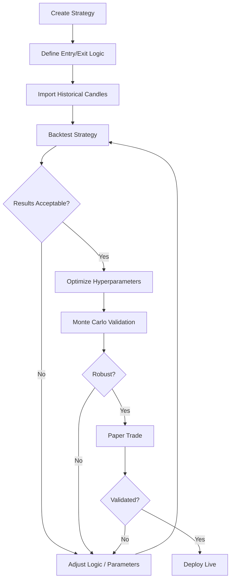
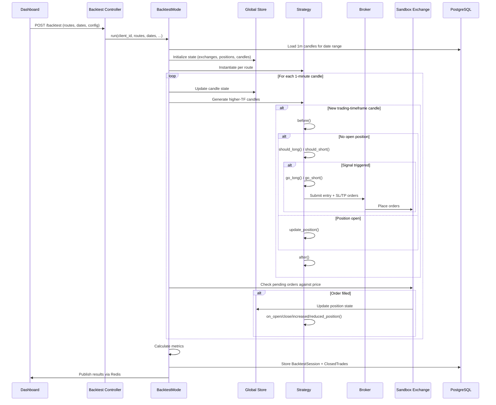
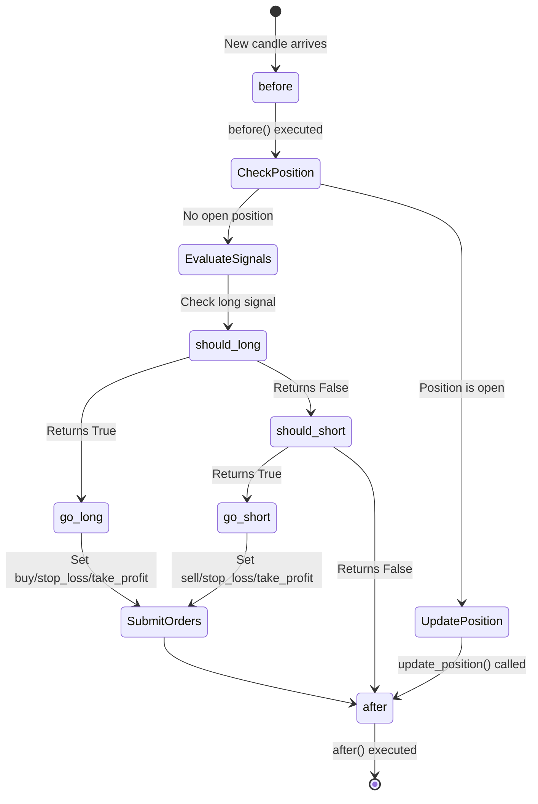
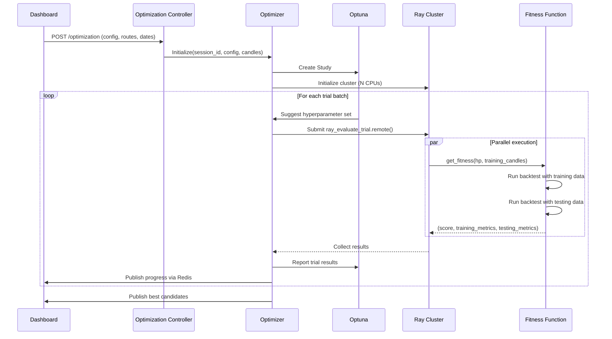
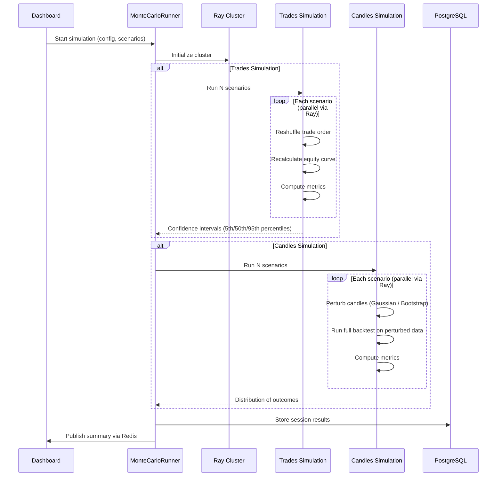
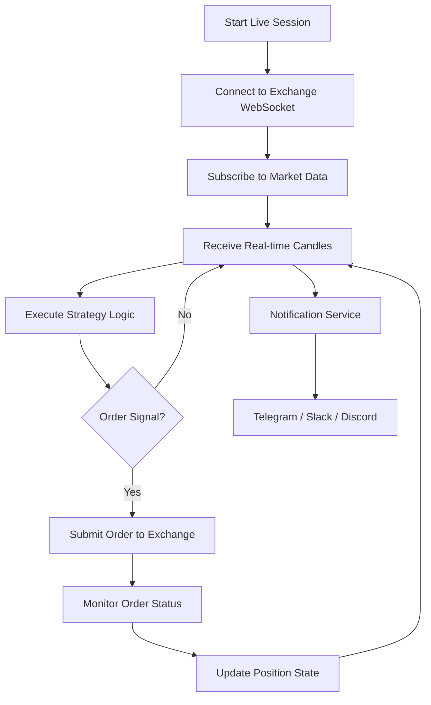
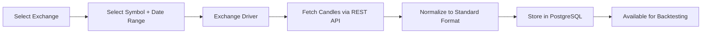

# Jesse -- Workflows

## Strategy Development Workflow



## Backtesting Workflow

### Data Flow



### Strategy Lifecycle per Candle



## Optimization Workflow



## Monte Carlo Workflow



## Live Trading Workflow

Live trading (requires `jesse-live` plugin) follows the same strategy lifecycle as backtesting but with real exchange connections:



## Candle Import Workflow



Each exchange has a dedicated driver (e.g., `BinancePerpetualFutures`, `BybitUSDTPerpetual`) that handles API pagination, rate limiting, and data format normalization. All candles are stored as 1-minute OHLCV records.

## Multi-Route Trading

Jesse supports trading multiple symbols and timeframes simultaneously within a single session:

```python
# Trading routes
routes = [
    {'exchange': 'Binance', 'symbol': 'BTC-USDT', 'timeframe': '1h', 'strategy': 'TrendFollower'},
    {'exchange': 'Binance', 'symbol': 'ETH-USDT', 'timeframe': '4h', 'strategy': 'MeanReversion'},
]

# Data-only routes (for cross-symbol analysis)
data_routes = [
    {'exchange': 'Binance', 'symbol': 'BTC-USDT', 'timeframe': '15m'},
]
```

Strategies on different routes share the global `store`, enabling cross-symbol and cross-timeframe analysis. A strategy on ETH-USDT can read BTC-USDT candles from the store to make correlated decisions.

---
## See Also
- [README](README.md) — Project overview and quick start
- [Architecture](architecture.md) — System design and components
- [State Management](state-management.md) — State lifecycle and data models
- [Development](development.md) — Development guide and best practices
